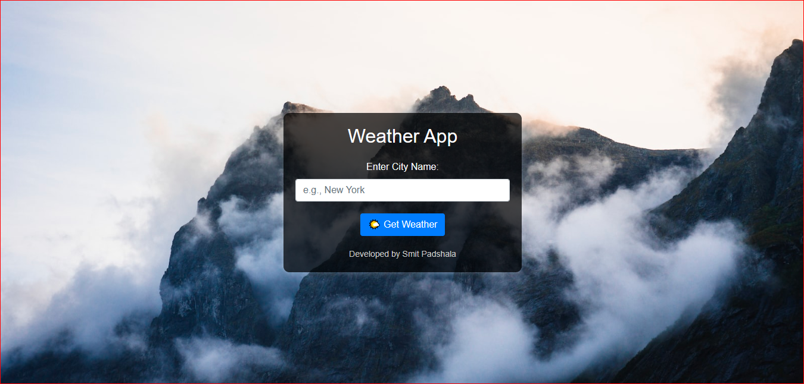

# Weather App



A simple weather application that allows users to check the current weather conditions of a city. The app uses the Weather by API-Ninjas API, available on [RapidAPI](https://rapidapi.com/apininjas/api/weather-by-api-ninjas).

## Features

- **Current Weather**: Get real-time information about the current weather conditions.
- **Dynamic Background**: The background image changes based on the current temperature for a more immersive experience.
- **Responsive Design**: The app is designed to work seamlessly on various devices.

## Demo

Check out the live demo [here](#) 

Clone the repository:

   ```bash
   git clone https://github.com/Smitpadshala99/Weather-App.git
